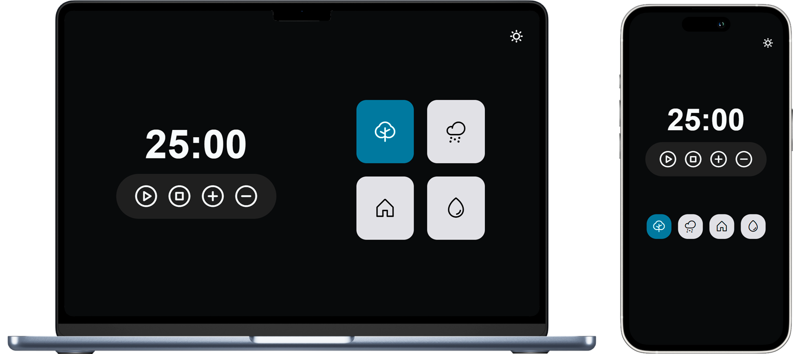

# desafio1-JavaScript

## 1º desafio de javascript do programa explorer
 

## 🚀 Tecnologias

Esse projeto foi desenvolvido com HTML, CSS e JavaScript

Desafio proposto por [rocketseat](https://https://www.rocketseat.com.br/)

## 🚀 Projeto

[Link do App Focustimer](http://andrey00005.github.io/focustimer2/)
<a href="http://andrey00005.github.io/focustimer2/" target="_blank">Focustimer</a>
